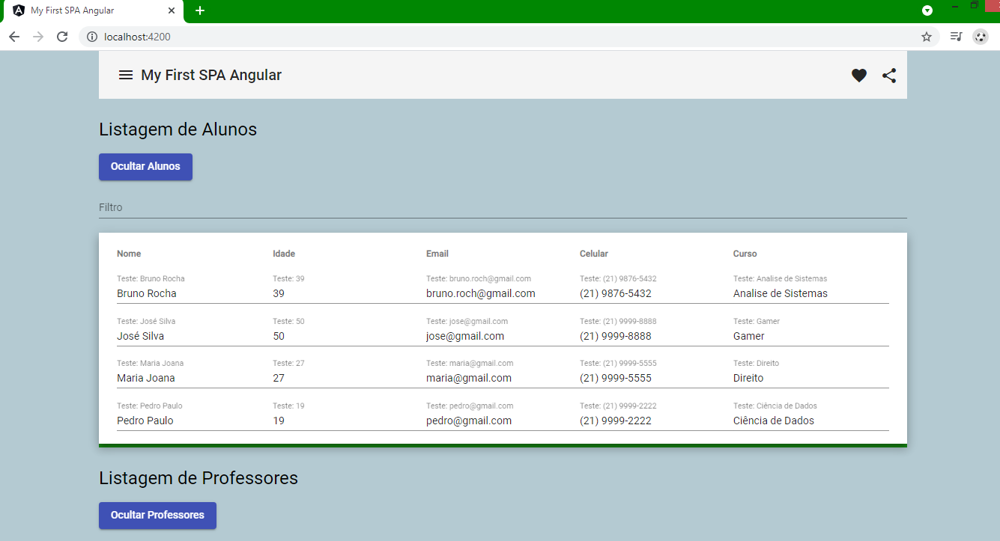

# My First SPA com Angular



- Instrutora: Camila Ferreira Ribeiro
- Plataforma de Ensino: https://digitalinnovation.one/sign-up?ref=K5EF2VCVKA
- Lab: Desenvolvendo SPA com Angular - Construindo uma Single Page Application

<hr>

## Vídeo Explicativo

[Youtube](https://youtu.be/QG2YvUlfTFQ)

<hr>

##  Objetivo

- Single Page Application Angular. Aplicação destinada a minha prática dos meus primeiros passos com Angular. Com obetivo de gerenciar uma listagem de Alunos e Professores, com rotas para as seções Home, Alunos, Professores e Error404. Para a exibição e alteração dos valores das listagens desta aplicação foi utilizado o conceito de two-way data binding. Aplicação é alimentada por arrays em constantes com tipos de dados personalizados (Aluno e Professores). No componente filtro do Angular Material, podemos filtrar o contéudo de qualquer campo da listagem correspondente. Evento de Exbir e Ocultar a listagem reaproveitando o mesmo botão.

<hr>

## Tecnologias Utilizadas

- Angular
- Typescript
- Javascript
- Angular Material
- HTML5
- CSS3
- Bootstrap
- Visual Studio Code

<hr>

## Labs - Conteúdo apresentado

- Introdução ao Angular
- Um breve resumo para se interar no tema
- Conhecendo os requisitos mínimos
- Gerando nossa primeira aplicação
- Abrindo seu projeto no Visual Studio Code
- Conhecendo alguns diretórios
- Utilizando o Angular Material
- Criando nosso primeiro componente
- Definindo nosso módulo como inicial
- Adicionando um componente do Angular Material
- Data Biding
- Event Biding
- Diretivas: ngIf / ngFor
- Event Emitter
- Observable
- Life Cycle hooks
- Dicas de conteúdo / Próximos passos
- Aprofundando o conhecimento
- Desafio

<hr>

## Desafio proposto

- 1) Crie uma aplicação Angular (Não esqueça que todo código precisa estar no GitHub)

- 2) Crie no mínimo 3 componentes que deverão estar interagindo na mesma página (Não esqueça das rotas)

- 3) Escolha no mínimo 4 componentes do Angular Material e incorpore eles em sua aplicação.

- 4) Crie em uma das páginas uma interação através da Interpolação e/ou utilizando Property Biding.

- 5) Crie uma explicação sobre o que foi feito, esta explicação será inserida na plataforma junto com o link para o código no GitHub.

- 6) Você poderá criar um vídeo demonstrativo da aplicação construída, e publicá-lo no YouTube, passando o link de acesso na plataforma. Este passo 6, não é obrigatório, mas entrará como um diferencial.

<hr>

## Executar aplicação completa

- Faça a instalação das dependências:

```
npm install
```

- Abra uma aba do seu terminal e execute a aplicação angular:

```
ng serve -o
```

- This project was generated with [Angular CLI] (https://github.com/angular/angular-cli) version 10.1.7

<hr>

## Autor

- Bruno Gamba Rocha
- https://www.linkedin.com/in/bruno-gamba-rocha/
